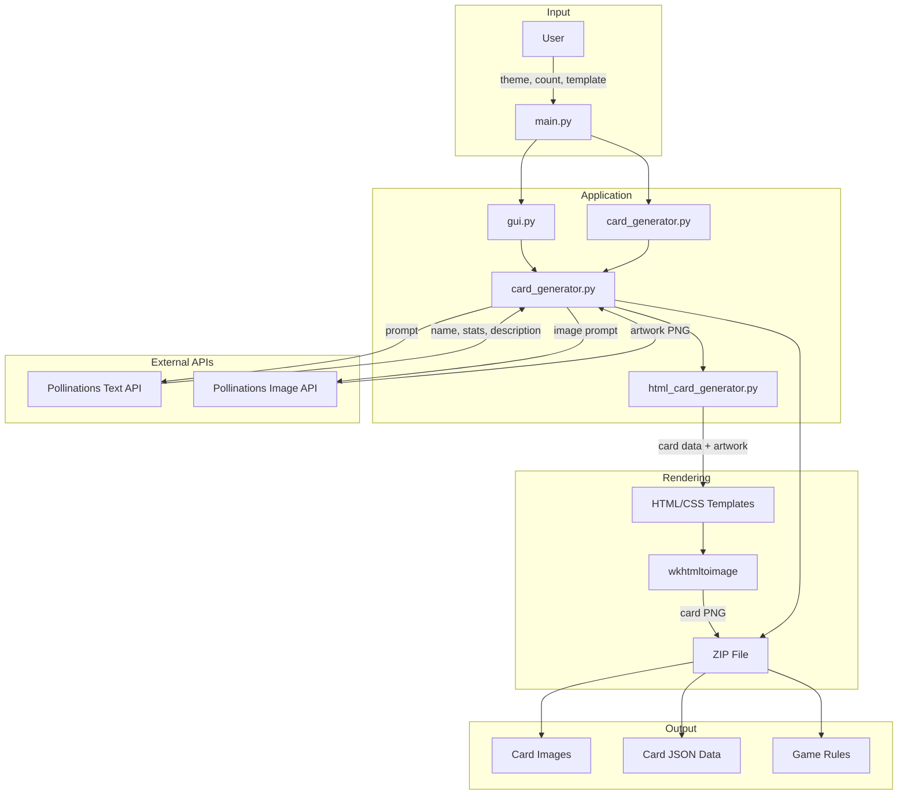

# Card Game Generator

A Python application that generates custom trading card games using AI. Provide a theme, and the application creates unique cards with AI-generated artwork, stats, and descriptions, then renders them as printable card images.


## How It Works

1. You provide a theme (e.g., "Fantasy", "Cyberpunk", "Pirates")
2. The app calls AI APIs to generate card names, descriptions, and stats
3. AI generates artwork for each card
4. Cards are rendered using HTML/CSS templates into printable images
5. Everything is packaged into a zip file with game rules

## Features

- **AI-Generated Content**: Uses Pollinations.ai for text and image generation (free, no API key required)
- **Multiple Templates**: Choose between "Bright Swiss Design" or "Detailed Representation" styles
- **GUI and CLI**: Graphical interface for casual use, command line for scripting
- **Complete Output**: Generates card images, JSON data, and basic game rules

## Architecture



## Installation

### Prerequisites

- Python 3.10 or higher
- [wkhtmltopdf](https://wkhtmltopdf.org/downloads.html) (for rendering cards)

### Setup

```bash
# Clone the repository
git clone https://github.com/siddharth-narigra/collectible-card-generator.git
cd collectible-card-generator

# Create virtual environment
python -m venv venv

# Activate (Windows)
.\venv\Scripts\activate

# Activate (macOS/Linux)
source venv/bin/activate

# Install dependencies
pip install -r requirements.txt
```

### Installing wkhtmltopdf

**Windows**: Download from [wkhtmltopdf.org](https://wkhtmltopdf.org/downloads.html) and add to PATH

**macOS**:

```bash
brew install wkhtmltopdf
```

**Ubuntu/Debian**:

```bash
sudo apt-get install wkhtmltopdf
```

## Usage

### GUI

```bash
python main.py
```

This opens a window where you can:

- Enter a theme
- Select number of cards (1-20)
- Choose a card template
- Generate your card game

### Command Line

```bash
cd src
python card_generator.py "Fantasy" 5 "bright_swiss"
```

Arguments:

- `theme`: Theme for the cards
- `num_cards`: Number of cards to generate (default: 5)
- `template`: Template style - `bright_swiss` or `detailed` (default: `bright_swiss`)

## Output

The generated zip file contains:

```
theme_card_game/
├── cards/
│   ├── card_name_0.json      # Card data
│   ├── card_name_0.png       # Rendered card image
│   ├── raw_card_name_0.png   # AI-generated artwork
│   └── ...
├── game_info/
│   └── game_rules.txt
└── README.md
```

### Card Data Format

```json
{
    "name": "Shadow Knight",
    "description": "A warrior who draws power from darkness",
    "image_prompt": "Dark armored knight with shadow powers",
    "stats": {
        "attack": 8,
        "defense": 6,
        "health": 10
    },
    "card_type": "creature"
}
```

## Templates

| Template                | Style                                            |
| ----------------------- | ------------------------------------------------ |
| Bright Swiss Design     | Modern, bold typography with yellow/blue accents |
| Detailed Representation | Ornate frame design with textured elements       |

## Project Structure

```
collectible-card-generator/
├── assets/                    # HTML/CSS card templates
├── output/                    # Generated card games
├── src/
│   ├── card_generator.py      # Core generation logic
│   ├── html_card_generator.py # Template rendering
│   └── gui.py                 # Tkinter GUI
├── main.py                    # Application entry point
├── requirements.txt
└── LICENSE
```

## Troubleshooting

**"wkhtmltoimage not found"**

- Ensure wkhtmltopdf is installed and added to your system PATH

**API errors or timeouts**

- The app uses free AI APIs which may occasionally be slow or unavailable
- Fallback content is generated automatically when APIs fail

**No cards generated**

- Check your internet connection
- Try generating fewer cards

## Tech Stack

- Python with Tkinter for GUI
- Pollinations.ai for AI text and image generation
- wkhtmltopdf for HTML to image conversion

## License

MIT License
